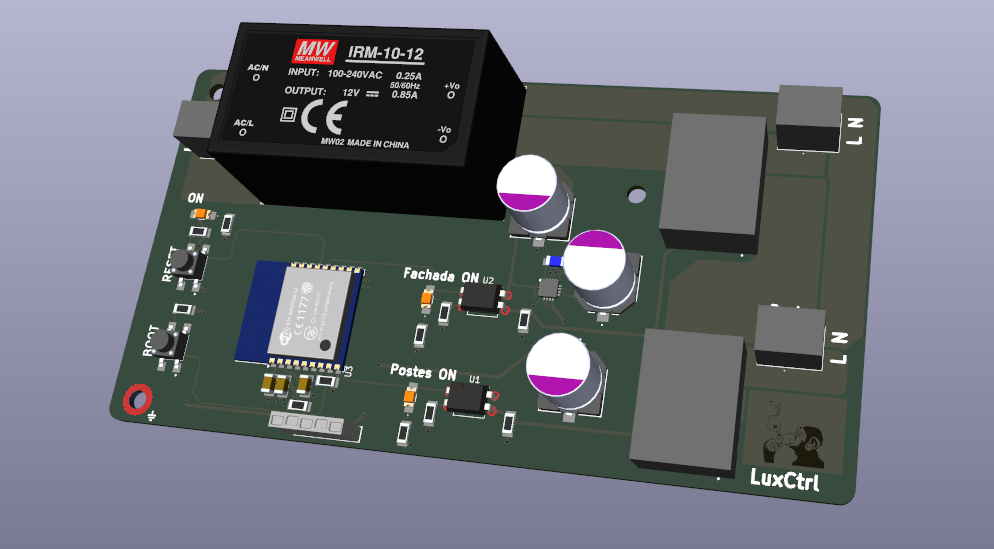

# LuxCtrl

Intelligent outdoor lighting controller for facades and poles, based on ESP-WROOM-02 and opto-coupled relays. Allows remote control via UDP and MQTT protocols, with secure separation between power and digital domains.
---

## 🧠 Description 

**LuxCtrl** is a WiFi-enabled smart lighting controller designed to automate outdoor lights (facade and post lights). Built around the **ESP-WROOM-02**, it features:

- 2 isolated relay channels for controlling 230 VAC loads.
- Power domain separation (opto-isolated control + ferrite decoupling).
- Integrated **12 V and 3.3 V regulation** using IRM-10-12 and buck converter.
- Smart control via **UDP** (Raspberry Pi) and **MQTT** (mobile app).
- Visual feedback with onboard LEDs for power and relay states.

---

## ⚙️ Features

- ✅ **Dual AC relay output** (for facade and post lights).
- ✅ **Optocouplers (SFH617A-1)** for galvanic isolation.
- ✅ **ESP-WROOM-02** soldered directly on PCB.
- ✅ **Onboard buck converter** for 3.3 V supply.
- ✅ **Power On + Relay status LEDs**.
- ✅ **PE pad** for safe chassis grounding.
- ✅ Designed for **home installations**, with wide copper zones (≥6 mm) for AC.
- ✅ Compatible with **JLCPCB fabrication** (ENIG finish recommended).

---

## 🛠️ Hardware Summary

| Component      | Description                              |
|----------------|------------------------------------------|
| ESP-WROOM-02   | WiFi microcontroller module              |
| IRM-10-12      | 230 VAC to 12 V isolated power supply     |
| Buck Converter | 12 V → 3.3 V step-down for ESP            |
| SFH617A-1      | Optocouplers for relay control            |
| SRD-12VDC-SL-C | Relays for AC load switching              |
| Ferrite Bead   | Mass separation (digital ↔ power)         |

---

## 📦 Installation

1. Mount the PCB inside a protective enclosure (PE connected).
2. Connect AC input (L/N) and outputs to facade and post light circuits.
3. Provide AC power and connect the PCB to your WiFi.
4. Program the ESP via UART using external USB–Serial adapter.
5. Control via:
   - Local UDP from Raspberry Pi.
   - MQTT broker + mobile app interface.

---

## 📁 Project Structure

- `/hardware`: KiCad files, schematics, PCB layout.
- `/firmware`: ESP code (Arduino / ESP-IDF).
- `/app`:  Mobile app or MQTT interface.

---

## 📷 Preview

---

## 🛡️ Disclaimer

> ⚠️ **Warning**: This board handles mains voltage (230 V AC). Make sure you follow proper safety measures during assembly and installation. Use adequate insulation, PE connection and enclosure. This is not a certified product.
> **This project is provided as is, with no warranty.**
> I am not responsible for damage, accidents, injuries, or failures resulting from improper use, modification, or implementation of this design.

---

## ✨ Author

**Cesar** – *Mechatronics & Embedded Systems Engineer*  
`luxctrl` ✨

---
